# ViMOP 手把手操作指南（新手零基础上手版）

> 目标：**从未接触过生信流程的人，照着本文档 step-by-step 操作，就能在自己的数据上跑出病毒基因组。**
> 基于本机部署版本 v1.0.6（2026-10-05 实测验证）。所有命令都复制即可用，路径均为本机真实路径。
> 想看原理剖析（每个工具是什么、流程为什么这么设计），见文末「附录」。

---

## 目录

- [第 0 章：开始前检查（5 分钟）](#第-0-章开始前检查5-分钟)
- [第 1 章：跑通第一个示例（30 分钟）](#第-1-章跑通第一个示例30-分钟)
- [第 2 章：跑自己的数据（正式操作）](#第-2-章跑自己的数据正式操作)
- [第 3 章：看懂结果](#第-3-章看懂结果)
- [第 4 章：常用场景速查卡](#第-4-章常用场景速查卡)
- [第 5 章：报错排查表](#第-5-章报错排查表)
- [第 6 章：术语表](#第-6-章术语表)
- [附录：原理详解](#附录原理详解)

---

## 第 0 章：开始前检查（5 分钟）

依次复制下面命令，**每条都有预期输出**，对不上先解决再往下走。

### 0.1 检查内存和 CPU（流程最低要求 80G 内存 / 24 核）

```bash
free -g | head -2      # 预期：可用（available）≥ 80
nproc                  # 预期：≥ 24
```

### 0.2 检查 Docker 可用

```bash
docker images | grep oprgroup
```

预期看到 7 行（`canu`、`centrifuge`、`general`、`ingress`、`medaka`、`report`、`structural_variants`）。缺任何一个联系管理员用 `pull_missing_images.py` 补齐。

### 0.3 检查数据库就位

```bash
ls /data/databases/vimop/v1.0.6/
```

预期看到 3 个目录：`centrifuge  contaminants  virus`。

### 0.4 确认 Nextflow 版本调用方式

本机必须锁 25.10.2（默认版本不兼容），运行命令统一长这样：

```bash
NXF_VER=25.10.2 nextflow run ...
```

> 💡 可以把 `export PATH=/data/miniconda3/bin:$PATH` 写进 `~/.bashrc`，确保 nextflow/docker 找得到。

---

## 第 1 章：跑通第一个示例（30 分钟）

用官方模拟数据（已知含 LASV 病毒 L/S 段 + MS2 噬菌体）验证你会操作全流程。**跑通这个，你的环境就没问题。**

### Step 1：复制命令并运行

```bash
NXF_VER=25.10.2 nextflow run /gemini/pipelines/vimop \
  -c /gemini/pipelines/vimop/deployment.config \
  --fastq /data/work/vimop/test_data/vimop-demo/lasv_simulated \
  --out_dir /gemini/pipelines/vimop/output/my_first_run
```

### Step 2：看懂屏幕上发生的事

运行后会刷出不断更新的任务表，长这样：

```
executor >  local (6)
[5b/05d055] fastcat (1)                     | 1 of 1 ✔
[63/6abd26] pipeline:trim (1)               | 1 of 1 ✔
[4b/27b5da] pipeline:classify_centrifuge (1) | 0 of 1   ← 正在跑
...
```

- 每行是一个**处理步骤**（任务）；`1 of 1 ✔` = 完成，`0 of 1` = 进行中
- 前面的 `[5b/05d055]` 是任务编号，排查问题时用
- **demo 数据约 10 分钟跑完**（官方参考值 87 个任务全部 ✔，耗时 10m 18s）

### Step 3：确认跑完

最后应看到类似：

```
Completed at: xx-xxx-2026 xx:xx:xx
Duration    : 10m 18s
Succeeded   : 87
```

> ⚠️ 中途想看进度但不敢关窗口？流程在你**关闭终端后会被杀**。正式跑自己的数据请用第 2.5 节的「后台运行」方法。

### Step 4：核对结果（三条命令）

```bash
# ① 三个病毒的一致序列是否都生成了？
ls /gemini/pipelines/vimop/output/my_first_run/barcode01/selected_consensus/
# 预期：LASV_L.fasta  LASV_S.fasta  MS2.fasta

# ② 核心统计表
cat /gemini/pipelines/vimop/output/my_first_run/barcode01/tables/consensus.tsv

# ③ HTML 报告（把文件下载到本地浏览器打开）
ls /gemini/pipelines/vimop/output/my_first_run/barcode01/report_barcode01.html
```

`consensus.tsv` 预期 3 行数据，关键列：`Mapped reads`（约 798/997/999）、`Average read coverage`（约 83~176）、`Coverage`（93%~96%）、`IsBest` 全为 `True`。**数字接近即算通过**，允许小幅波动。

✅ **到这里，你已经掌握了流程的全部基本操作。** 下面进入正式使用。

---

## 第 2 章：跑自己的数据（正式操作）

### 2.1 准备数据（最重要的一步）

ViMOP 对输入目录的要求非常宽松，**三种形式都行**：

| 你的数据情况 | `--fastq` 指向 | 样本名 |
|---|---|---|
| 单个 fastq 文件 | 文件本身路径 | 文件名 |
| 一个样本的多个 fastq | 所在目录 | 目录名 |
| 多样本（barcode01/02/...） | **上级目录** | 每个 barcode 子目录名 = 样本名 |

```bash
# 典型目录结构（ONT 机下机数据直接可用）：
my_run/
├── barcode01/
│   ├── xxx.fastq.gz
│   └── yyy.fastq.gz
├── barcode02/
│   └── zzz.fastq.gz
└── barcode03/
    └── ...
```

支持的文件后缀：`.fastq`、`.fastq.gz`、`.fq`、`.fq.gz`（压缩不压缩都行，会自动合并统计）。

**想自定义样本名**（比如 barcode01 → "病人A"）：建一个 CSV 文件：

```csv
barcode,alias
barcode01,病人A
barcode02,病人B
```

运行时加 `--sample_sheet /路径/样本表.csv` 即可（CSV 至少含 `barcode` 和 `alias` 两列）。

### 2.2 启动运行

```bash
NXF_VER=25.10.2 nextflow run /gemini/pipelines/vimop \
  -c /gemini/pipelines/vimop/deployment.config \
  --fastq /你的数据目录 \
  --out_dir /gemini/pipelines/vimop/output/项目名_日期
```

**`--out_dir` 建议起名规范**：`项目名_日期`（如 `lassa_batch3_20261005`），方便日后追溯。每个 run 用独立目录，不要覆盖旧结果。

### 2.3 运行中要多久？

参考（40 核 / 125G 内存机器）：

| 数据量 | 大致耗时 |
|---|---|
| demo（5000 reads） | 10 分钟 |
| 单样本约 10 万 reads | 0.5~2 小时 |
| 多样本/高深度 | 数小时~过夜 |

最吃时间的步骤：`assemble_canu`（组装）和 `medaka`（神经网络纠错）。流程会自动并行多个样本/多个任务。

### 2.4 怎么监控进度

另开一个终端窗口：

```bash
# 方法1：看实时日志（Ctrl+C 退出查看，不会杀流程）
tail -f /gemini/pipelines/vimop/.nextflow.log | grep -E 'Submitted|Completed|ERROR'

# 方法2：看任务统计（Succeeded 数在涨就是正常）
grep 'Workflow completed' /gemini/pipelines/vimop/.nextflow.log | tail -1
```

> 💡 本机排查进程时注意：nextflow 实际进程是 `java -jar nextflow-25.10.2-one.jar run ...`，用 `pgrep -af nextflow-25.10.2` 查找。

### 2.5 后台运行（推荐，关终端也不停）

```bash
cd /gemini/pipelines/vimop
NXF_VER=25.10.2 nohup nextflow run /gemini/pipelines/vimop \
  -c deployment.config \
  --fastq /你的数据目录 \
  --out_dir /gemini/pipelines/vimop/output/项目名_日期 \
  > /data/work/vimop/run_项目名_日期.log 2>&1 &

echo "流程 PID: $!"    # 记下这个数字
```

- 随时 `tail -f /data/work/vimop/run_项目名_日期.log` 看进度
- 想停止：`kill <PID>`

### 2.6 中断后恢复

好消息：**Nextflow 有断点续跑**。被 kill/断电/报错后，原命令原样再跑一遍即可——已完成的任务直接复用缓存，从断点继续。

```bash
# 与 2.2 完全相同的命令再跑一次
NXF_VER=25.10.2 nextflow run ... --out_dir 同一个目录
```

---

## 第 3 章：看懂结果

### 3.1 输出目录结构

```
my_first_run/                       # = --out_dir
├── barcode01/                      # 每个样本一个目录
│   ├── report_barcode01.html       # ⭐ 主报告：先看这个
│   ├── selected_consensus/         # ⭐ 最终挑选的最佳一致序列（最重要产物）
│   │   ├── LASV_L.fasta
│   │   └── ...
│   ├── consensus/                  # 全部候选的详细比对结果
│   │   ├── <参考ID>.consensus.fasta   # 一致序列
│   │   ├── <参考ID>.reads.bam         # 比对文件（IGV 可视化用）
│   │   ├── <参考ID>.depth.txt         # 每个位点的测序深度
│   │   └── <参考ID>.structural_variants.vcf  # 结构变异
│   ├── assembly/
│   │   ├── no-target.contigs.fasta    # 组装出的所有 contig
│   │   └── re-assembly.contigs.fasta  # 迭代重组装的补充 contig
│   ├── classification/             # centrifuge 物种分类结果
│   └── tables/                     # 三张机读统计表
│       ├── reads.tsv               # reads 清洗流程（每步剩多少）
│       ├── contigs.tsv             # 每个 contig 的分类+BLAST 命中
│       └── consensus.tsv           # 每个候选 consensus 的质量指标
├── barcode02/ ...
└── nf-report-*.html                # 流程运行技术报告（任务耗时/资源）
```

### 3.2 判断样本里有没有病毒（阳性判定）

**第一步：打开 `report_<样本>.html`**（下载到本地浏览器），它会给你图形化汇总。然后对照 `tables/consensus.tsv` 看具体数字。

**阳性标准（全部满足）**：

| 指标 | 列名 | 合格线 | 含义 |
|---|---|---|---|
| 支持 reads 数 | `Mapped reads` | ≥ 50（经验值） | 有多少条 reads 支持这个病毒 |
| 平均深度 | `Average read coverage` | ≥ 20 | 每个位点平均被测了多少次 |
| 序列覆盖度 | `Coverage` / `Positions called` | ≥ 90% 为佳 | 基因组被测全的百分比 |
| N 比例 | `ConsensusLength` vs `Length` | N 越少越好 | 低深度区被输出为 N |
| 是否最佳 | `IsBest` | True | 流程自动判定的最优结果 |

**demo 实测参照值**（你心里有个数）：

| 病毒 | Mapped reads | 深度 | 覆盖度 |
|---|---|---|---|
| LASV L | 999 | 83x | 96.1% |
| LASV S | 997 | 176x | 95.3% |
| MS2 | 798 | 130x | 93.3% |

**典型情况判读**：

| 你看到的情况 | 说明 |
|---|---|
| 高深度 + 高覆盖 + 低 N | ✅ 明确阳性，可直接用 `selected_consensus/*.fasta` |
| reads 很多但覆盖度低、断成几段 | 可能是新变种/降解样本，看 bam 确认 |
| 只有 contig 命中病毒但没有 consensus | reads 深度不够（<20x），病毒信号弱 |
| 完全没有任何命中 | 阴性（或病毒不在数据库里） |
| 人源 reads 占比 >50% 的"病毒" | ⚠️ 宿主源假阳性嫌疑，按本站规定需二次验证 |

### 3.3 其他文件什么时候看

| 文件 | 什么时候看 |
|---|---|
| `tables/reads.tsv` | 清洗是否过度（比如病毒 reads 被误删） |
| `classification/*.tsv` | 想知道样本里还有什么（细菌/寄生虫组成） |
| `contigs.tsv` | 组装质量：contig 长度、一致性、参考覆盖 |
| `*.reads.bam` | 用 IGV 软件可视化，人工检查比对质量（重要阳性建议看） |
| `nf-report-*.html` | 流程哪个步骤最耗时、资源占用 |

---

## 第 4 章：常用场景速查卡

### 场景 A：病毒基因组已知比较小（如 12kb），想跑快一点

```bash
  --canu_genome_size 12000
```

### 场景 B：不要结构变异分析（SV 对结论不重要时省时间）

```bash
  --sv_do_call_structural_variants false
```

### 场景 C：只用简单快速的一致性序列（不跑神经网络 medaka）

```bash
  --consensus_method simple
```
速度快但准确度略低；默认 `auto`（能识别测序模型就用 medaka）。

### 场景 D：我有自己怀疑的参考序列，让它一并参与比对

```bash
  --custom_ref_fasta /你的路径/参考.fasta
```

### 场景 E：样本污染复杂（粪便等），加强非病毒过滤

默认已开启 centrifuge 过滤（≥100 分才删）。更激进：
```bash
  --centrifuge_filter_min_score 150
```
⚠️ 分数越高删得越狠，误删病毒风险增加。

### 场景 F：把清洗后的 reads 也保留下来

```bash
  --output_cleaned_reads true
```
输出目录会多一个 `clean/` 子目录（占用磁盘大，默认不输出）。

### 完整命令模板（复制改路径即用）

```bash
NXF_VER=25.10.2 nextflow run /gemini/pipelines/vimop \
  -c /gemini/pipelines/vimop/deployment.config \
  --fastq /你的数据目录 \
  --out_dir /gemini/pipelines/vimop/output/项目名_日期 \
  --canu_genome_size 30000 \
  --consensus_method auto
  # 按需追加其他参数
```

---

## 第 5 章：报错排查表

| 报错/现象 | 原因 | 解决 |
|---|---|---|
| `No fastqs provided! Exit.` | `--fastq` 路径错或目录里没有 fastq | 检查路径；确认文件后缀是 .fastq/.fq（可带 .gz） |
| 启动就报内存/磁盘不足 | `deployment.config` 要求 80G 内存/100G 磁盘 | 换大机器或改 `deployment.config` 里的 `min_ram_gb`（后果自负） |
| 任务卡在 `assemble_canu` 很久 | 正常，组装最慢 | 等；reads 越多越久 |
| `ERROR ~ Error executing process` + 某个任务 | 看 `.nextflow.log` 里该任务 work 目录的 `.command.err` | 把错误信息发管理员 |
| 之前跑一半断了 | — | 原命令重跑 = 断点续跑（见 2.6） |
| 结果目录里某样本缺 `selected_consensus/` | 该样本没有任何病毒阳性 | 正常，看 report 确认 |
| 改了 `deployment.config` 或 nextflow.config 后行为怪异 | 配置语法错 | `nextflow run` 启动时会校验，按报错行号检查 |
| 想换数据库版本 | 改 `deployment.config` 中 `database_defaults.base` 指向新版本目录 | 数据库下载用 `download_official_db.py` |

---

## 第 6 章：术语表

| 术语 | 大白话解释 |
|---|---|
| **fastq** | 测序原始数据文件，每条 read 带质量分数 |
| **barcode** | ONT 多样本混测时给每个样本贴的"标签"，下机后按 barcode 分目录 |
| **read** | 一条测序读段（几百~几万碱基） |
| **contig** | 组装片段：把重叠的 reads 拼起来得到的较长连续序列 |
| **consensus（一致序列）** | 把 reads 比对到参考后，每个位点取最可能的碱基，得到的"最终 genome 序列" |
| **深度（coverage/depth）** | 基因组每个位点平均被多少条 reads 测到，20x 以上才可靠 |
| **N** | 该位点深度不够/碱基无法确定，输出为 N |
| **参考基因组（reference）** | 已知病毒的"标准序列"，用来当模板比对 |
| **BLAST** | 序列相似性搜索：contig 去病毒库里找最像谁 |
| **centrifuge** | 快速物种分类工具，给每条 read 猜"你是哪个物种" |
| **minimap2** | 长读长比对工具（ONT 数据标配） |
| **canu** | 长读长基因组组装工具（把 reads 拼成 contig） |
| **medaka** | ONT 官方神经网络纠错工具（用 AI 模型修正测序错误） |
| **结构变异（SV）** | 大的插入/缺失/倒位（几百 bp 以上） |
| **Nextflow** | 流程引擎：把上面所有工具按顺序串起来跑，支持断点续跑 |
| **work 目录** | 中间文件目录（`/data/work/vimop`），正式结果不依赖它 |

---

## 附录：原理详解

> 新手可先跳过，跑通后再回来读，会理解每一步在做什么、为什么。

### 全流程彩色图

```mermaid
flowchart TD
    A["📦 输入 fastq 目录<br/>(可含 barcode01/02... 多样本)"] --> B["阶段0 数据接入<br/>fastcat 统计"]

    subgraph S1["①  reads 层面：清洗"]
        B --> C["阶段1 去接头<br/>seqtk trimfq + seqkit"]
        C --> D{"阶段2 宏基因组分类<br/>centrifuge"}
        D --> E["阶段3 非病毒reads过滤<br/>centrifuge ≥100分非病毒 → 删"]
        E --> F["阶段4 污染物过滤<br/>minimap2 顺序去除<br/>人/鼠/蚊等"]
        F --> G["阶段5 靶向提取<br/>minimap2 比对病毒目标<br/>保留比对上的reads 按目标分组"]
    end

    subgraph S2["② 组装层面：拼基因组"]
        G --> H["阶段6 canu 组装<br/>-fast 模式"]
        H --> I["阶段7 迭代重组装<br/>去掉已拼出contig的reads再组装"]
        I --> J["阶段8 contig 分类<br/>centrifuge -f"]
    end

    subgraph S3["③ 参考层面：找模板"]
        J --> K["pop_bubbles 去bubble contig"]
        K --> L["阶段9 blastn 搜病毒库<br/>找最佳参考基因组"]
        L --> M["blastdbcmd 取出参考序列"]
    end

    subgraph S4["④ consensus 层面：生成一致序列"]
        M --> N["阶段10 minimap2 比对<br/>samtools sort/index"]
        N --> O{"阶段11 结构变异<br/>(默认开, sniffles)"}
        O --> P["bcftools consensus 把SV写入序列"]
        P --> Q["阶段12 一致性序列<br/>medaka 或 samtools simple"]
    end

    subgraph S5["⑤ 报告层面"]
        Q --> R["阶段13 统计+HTML报告"]
        R --> S["阶段14 选出最佳consensus + 输出"]
    end

    classDef input fill:#8e44ad,color:#fff,stroke:#6c3483
    classDef reads fill:#3498db,color:#fff,stroke:#21618c
    classDef asm fill:#e67e22,color:#fff,stroke:#af601a
    classDef ref fill:#27ae60,color:#fff,stroke:#1e8449
    classDef cons fill:#c0392b,color:#fff,stroke:#922b21
    classDef rep fill:#16a085,color:#fff,stroke:#117864

    class A input
    class B,C,D,E,F,G reads
    class H,I,J asm
    class K,L,M ref
    class N,O,P,Q cons
    class R,S rep
```



### 三阶段直觉

1. **Reads 阶段**（蓝）：数据里有什么？把不要的（接头/人/鼠/非病毒）扔掉
2. **Assembly 阶段**（橙）：病毒基因组长什么样？canu 组装 + 迭代重组装抓次要变种
3. **Consensus 阶段**（红/绿）：准确序列是什么？找参考 → 比对 → medaka AI 纠错

### 关键工具速查

| 工具 | 干什么 | 出现在哪 |
|---|---|---|
| fastcat | reads 合并统计 | 阶段0 |
| seqtk / seqkit | 切接头、长度过滤、格式处理 | 阶段1,6 |
| centrifuge | 物种分类（k-mer 速度型） | 阶段2,8 |
| minimap2 | 长读长比对 | 阶段4,5,10 |
| samtools | bam 操作/统计 | 阶段4~13 到处用 |
| canu | 长读长组装 | 阶段6,7 |
| cd-hit-est | 序列聚类去冗余 | 阶段6,7 |
| blastn / blastdbcmd | 病毒库搜索/取序列 | 阶段9 |
| sniffles / cuteSV | 结构变异检测 | 阶段11 |
| bcftools | VCF 过滤/一致性序列 | 阶段11,12 |
| medaka | ONT 神经网络纠错 | 阶段12 |
| samtools consensus | 简单多数投票一致序列 | 阶段12(simple) |

### 三大数据库

| 子库 | 版本 | 大小 | 用在哪 |
|---|---|---|---|
| `virus/` | 2.4 | 13G | BLAST 找参考（阶段9） |
| `contaminants/` | 1.2 | 3G | 污染过滤（阶段4）：人/鼠/蚊等 |
| `centrifuge/` | 1.1 | 24G | 物种分类（阶段2/8） |

位置：`/data/databases/vimop/v1.0.6/`（本机）。

### 进阶学习路径

1. 跑通 demo，对照附录流程图找每个数字对应哪步
2. 读 `lib/processes.nf` 中 5 个关键 process（`filter_contaminants`、`assemble_canu`、`reassemble_canu`、`medaka_variant_consensus`、`sample_report`）——shell 块就是真实命令行
3. 改参数重跑 demo 对比（`simple` vs `medaka`），用 IGV 看 bam
4. 研究阶段7 迭代重组装——ViMOP 区别于简单流程的核心设计

---

*本文档与本机 `CLAUDE.md`、`DEPLOYMENT.md` 配套使用。最后更新：2026-10-05（上手操作版重构）。*
