# ViMOP 新手上手指南

> 面向零基础用户的 ViMOP（Virus Metagenomics and Outbreak Preparedness pipeline）深度解析。
> 基于本机部署版本 **v1.0.6**（commit `1d72aa3`）源码逐行分析整理，结合 2026-10-05 本机实测验证。
> 官方仓库：https://github.com/OPR-group-BNITM/vimop

---

## 一、ViMOP 是什么？

ViMOP 是德国汉堡热带医学研究所（BNITM）疫情应对与准备组（OPR）开发的 **Nanopore（ONT）长读长病毒基因组组装流程**。

**一句话概括**：把一份临床/动物样本的 Nanopore 测序原始数据（fastq）扔进去，自动完成「去接头 → 去宿主/污染物 → 找病毒 → 组装 → 比对参考 → 纠错生成一致序列 → 出报告」全流程。

| 项目 | 说明 |
|---|---|
| 适用对象 | 人临床样本、动物样本中的**病毒**（尤其 LASV 拉沙病毒、DENV 登革、EBOV 埃博拉等中小基因组 RNA 病毒效果最好） |
| 测序平台 | Oxford Nanopore（ONT）长读长 |
| 输入 | 一个含 fastq（可含 `barcode01/02/...` 子目录）的目录，多样本自动识别 |
| 输出 | 每个样本：HTML 报告 + consensus 一致序列 + bam 比对 + 分类/统计表 |
| 局限 | 大型 DNA 病毒（如 mpox）重复区多，组装结果应视为**草稿**，需人工检查 bam |
| 底层框架 | Nextflow（DSL2）+ Docker，7 个容器镜像 |

---

## 二、总体流程图（彩色）

```mermaid
flowchart TD
    A["📦 输入 fastq 目录<br/>(可含 barcode01/02... 多样本)"] --> B["阶段0 数据接入<br/>fastcat 统计"]

    subgraph S1["①  reads 层面：清洗"]
        B --> C["阶段1 去接头<br/>seqtk trimfq + seqkit"]
        C --> D{"阶段2 宏基因组分类<br/>centrifuge"}
        D --> E["阶段3 非病毒reads过滤<br/>centrifuge ≥100分非病毒 → 删"]
        E --> F["阶段4 污染物过滤<br/>minimap2 顺序去除<br/>人/鼠/蚊等"]
        F --> G["阶段5 靶向提取<br/>minimap2 比对病毒目标<br/>保留比对上的reads<br/>按目标分组"]
    end

    subgraph S2["② 组装层面：拼基因组"]
        G --> H["阶段6 canu 组装<br/>-fast 模式"]
        H --> I["阶段7 迭代重组装<br/>去掉已拼出contig的reads<br/>再组装 (≤20轮)"]
        I --> J["阶段8 contig 分类<br/>centrifuge -f"]
    end

    subgraph S3["③ 参考层面：找模板"]
        J --> K["pop_bubbles<br/>去bubble contig"]
        K --> L["阶段9 blastn 搜病毒库<br/>找最佳参考基因组"]
        L --> M["blastdbcmd<br/>取出参考序列"]
    end

    subgraph S4["④ consensus 层面：生成一致序列"]
        M --> N["阶段10 minimap2 比对<br/>trimmed reads → 参考<br/>samtools sort/index"]
        N --> O{"阶段11 结构变异<br/>(默认开, sniffles)"}
        O --> P["bcftools consensus<br/>把SV写入序列"]
        P --> Q["阶段12 一致性序列<br/>medaka(神经网络纠错)<br/>或 samtools simple"]
    end

    subgraph S5["⑤ 报告层面"]
        Q --> R["阶段13 统计+HTML报告<br/>sample_report"]
        R --> S["阶段14 选出最佳consensus<br/>+ 输出整理"]
    end

    classDef input fill:#8e44ad,color:#fff,stroke:#6c3483
    classDef reads fill:#3498db,color:#fff,stroke:#21618c
    classDef asm fill:#e67e22,color:#fff,stroke:#af601a
    classDef ref fill:#27ae60,color:#fff,stroke:#1e8449
    classDef cons fill:#c0392b,color:#fff,stroke:#922b21
    classDef rep fill:#16a085,color:#fff,stroke:#117864

    class A input
    class B,C,D,E,F,G reads
    class H,I,J asm
    class K,L,M ref
    class N,O,P,Q cons
    class R,S rep
```



**三个阶段视角的理解**（新手最重要的直觉）：

1. **Reads 阶段**（蓝色）：回答"这份数据里有什么、把不要的扔掉"——分类、去污染、去靶向。
2. **Assembly 阶段**（橙色）：回答"病毒基因组长什么样"——canu 组装 + 迭代重组装。
3. **Consensus 阶段**（红/绿色）：回答"病毒的准确序列是什么"——找参考、比对、神经网络纠错、出一致序列。

---

## 三、逐阶段详解（每个工具都讲明白）

### 阶段 0｜数据接入 `fastq_ingress`（ingress 容器）

- **做什么**：扫描 `--fastq` 目录，识别 barcode 子目录作为不同样本；用 **fastcat** 合并/统计每个样本的 reads（数量、长度、质量分），生成初始统计。
- **新手理解**：相当于"收货登记"——先数数货（多少条 reads、多长、质量如何）。

### 阶段 1｜去接头 `trim`（general 容器）

- **工具**：`seqtk trimfq -b 30 -e 30`（两端各切 30bp）+ `seqkit seq -m 1`
- **做什么**：ONT 数据两端通常有接头/低质量区，固定切掉 `--trim_length`（默认 30）bp，并丢弃空序列。
- **新手理解**：像剪胶带两头——接头是测序时加的"胶带"，不是样本本身的序列。

### 阶段 2｜宏基因组分类 `classify_centrifuge`（centrifuge 容器）

- **工具**：
  - **centrifuge**（-p 12 线程，比对离心机索引）→ 每条 read 打上物种分类标签
  - **centrifuge-kreport** → 转成 kraken 风格报告（各分类层级 read 数）
  - **ktImportTaxonomy**（Krona）→ 生成交互式分类饼图 HTML
- **做什么**：用 centrifuge 索引（本库 `centrifuge 1.1`，25.5G）对全部 trimmed reads 做物种分类，告诉你样本里有人、细菌、病毒的混合比例。
- **对应代码**：`lib/processes.nf` 中 `classify_centrifuge`（reads 用 `-U`，contigs 用 `-f`）。

### 阶段 3｜读级过滤 `filter_with_centrifuge`（general 容器）

- **工具**：`filter_reads_by_centrifuge_classification.py`（流程自带脚本，`bin/`）
- **做什么**：把 centrifuge 分类中"**以 ≥ `--centrifuge_filter_min_score`（默认 100）分被判定为非病毒的 reads**"直接删除。这是激进的过滤器——confidence 很高才删，避免误删病毒。
- **参数**：`--centrifuge_do_filter false` 可关闭（样本污染复杂如粪便样本时可开，但要谨慎）。

### 阶段 4｜污染物过滤 `filter_contaminants`（general 容器）

- **工具**：**minimap2**（`-x map-ont` ONT 专用比对模式）+ **samtools fastq -f 4`（只保留未比对上的）
- **做什么**：按 contaminants 库（本库 `contaminants 1.2`：人基因组、人转录组、小鼠、埃及伊蚊、乳鼠 Mastomys）**顺序过滤**——能比对上污染参考的 reads 扔掉，剩下的进入下一步。每步都记录 reads 数统计。
- **新手理解**： centrifuge 是"猜身份"，这步是"实打实比对参考基因组"——比对上的就是污染物，扔掉。

### 阶段 5｜靶向提取 `filter_virus_target`（general 容器）

- **工具**：minimap2（大参考自动切索引 `-I 2G`）+ samtools `fastq -F 4`（**只保留比对上的 reads**）
- **做什么**：如果用户在病毒库 config 里指定了关注目标（virus targets，如"只要拉沙病毒"），把**能比对上该目标参考的 reads 单独提取出来**，打上 `mapping_target` 标签后**按目标分组独立组装**——让每个目标病毒有自己的组装通道，信号互不干扰。
- **注意区分**：阶段4 污染过滤是"`-f 4` 保留**没比对上**的"（去掉污染物），这步是"`-F 4` 保留**比对上**的"（提取目标）——符号相反，别搞混。

### 阶段 6｜组装 `assemble_canu`（canu 容器，最吃资源）

- **工具**：**canu**（`-fast` 快速模式，`-nanopore-raw`）+ seqtk（长度过滤）+ cd-hit-est（预聚类）
- **做什么**：
  1. 先按 `--canu_min_read_length`（默认 200bp）过滤短 reads；
  2. canu 纠错+组装出 contigs；
  3. **兜底机制**：如果一个 contig 都没拼出来（`nocontigs_enable_read_usage=true`），取最长的 10000 条 reads（优先纠错后），用 cd-hit-est 聚类（90% 相似度），取前 100 条代表序列**改名为伪 contig**——保证下游不空转。
- **关键参数**：`--canu_genome_size`（默认 30k，预估基因组大小，影响 canu 行为）。

### 阶段 7｜迭代重组装 `reassemble_canu`（canu 容器）⭐ 本流程特色

- **做什么**（最多 `--reassemble_max_iter` 轮，默认 2 轮）：
  1. 把"能比对到任何已有 contig 的 reads"去掉（minimap2 + `samtools fastq -f 4`）；
  2. 剩下的 reads 再跑一轮 canu；
  3. 新 contig 去冗余（cd-hit-est）后追加，作为下一轮的对照；
  4. 直到没有新 reads 或达到迭代上限。
- **为什么**：一个样本可能含**同一病毒的不同变种/分段**。首轮组装出主要变种后，与其相似的 reads 被"吸走"，剩下的次要变种 reads 才有机会拼出第二条 contig。这是 ViMOP 能多病毒/多变种检出的核心设计。

### 阶段 8｜contig 分类 `classify_contigs`

- 用 centrifuge 以 `-f`（fasta 模式）对所有 contigs（首轮+重组装）分类，附到每个 contig 上。

### 阶段 9｜BLAST 找参考（general 容器）

- **流程**：`pop_bubbles`（去掉 canu 标记 `bubble=yes` 的 contig）→ `prepare_blast_search`（按长度排序重命名）→ **blastn**（比对病毒库 blast_db，`-max_target_seqs 1` 只取最佳命中）→ `extract_blasthits`（解析 XML 提取参考 ID/家族/物种/分段/方向）→ `get_ref_fasta`（`blastdbcmd -entry` 取出参考序列）。
- **参考 ID 格式**（病毒库 fasta 头的约定）：`ID|描述|Family|Organism|Orientation|Segment`。

### 阶段 10｜比对到参考 `map_to_ref`（general 容器）

- **工具**：minimap2（`-ax map-ont --secondary=no`，窗口/kmer 参数可调）→ samtools view/sort/index。
- **做什么**：把**阶段1的 trimmed reads**（注意：不是组装用的 cleaned reads）全部比对到每个候选参考基因组，得到 sorted.bam。

### 阶段 11｜结构变异 `sniffles` / `cuteSV`（structural_variants 容器，可选）

- **做什么**（默认开启，`--sv_do_call_structural_variants`）：
  1. `subsample_alignments`：jvarkit `biostar154220` 把超高深度**降采样**到 `--sv_cap_coverage`（避免深度过高拖垮 SV  caller）；
  2. **sniffles**（默认）或 **cuteSV** 检结构变异（缺失/插入/倒位等）→ bcftools 按等位基因频率过滤；
  3. `structural_variant_consensus`：用 **bcftools consensus** 把 SV 直接写进参考序列，得到 sv_consensus；
  4. reads 重新比对到 sv_consensus。
- **新手理解**：SNP 小变异 medaka 能处理，但几百 bp 以上的大缺失/插入需要专门工具先改写"骨架"，再让纠错模型在正确骨架上工作。

### 阶段 12｜一致性序列 consensus（medaka 容器）⭐ 核心

三种模式（`--consensus_method`）：

| 模式 | 工具 | 原理 | 适用 |
|---|---|---|---|
| `medaka` | **medaka** | ONT 官方神经网络纠错：inference 生成概率 → vcf → gVCF → 按深度/质量过滤生成一致序列 | 最准确，**默认推荐** |
| `simple` | **samtools consensus** | 简单多数投票（`--call-fract` 比例 + `--min-depth` 深度），再经 `correct_samtools_consensus.py` 修正 | 快速、无 GPU/模型依赖 |
| `auto`（默认） | 自动选择 | 能解析出测序模型（`medaka tools resolve_model`）就用 medaka，否则回退 simple | 省心 |

- `--medaka_consensus_model auto`：根据 fastq 头里的 `model_version_id`（如 `dna_r10.4.1_e8.2_400bps_hac@v3.5.2`）自动选匹配的神经网络模型。

### 阶段 13｜统计与报告 `sample_report`（report 容器）

- **工具**：流程自带 `bin/` 下 5 个 mergestats 脚本 + **sample_html_report.py**（matplotlib 画图）。
- **产出**：
  - `report_<样本>.html`：交互式报告（reads 分布、分类饼图、contig 表、consensus 表、数据库版本）；
  - `tables/reads.tsv`、`contigs.tsv`、`consensus.tsv`：机读统计表。

### 阶段 14｜选优输出 `get_best_consensus_files` + `output`

- `get_curated_consensus_genomes.py`：从所有候选 consensus 中挑出最好的，放进 `selected_consensus/`。
- `output`：统一发布到 `--out_dir`（按 `<样本>/{classification,assembly,consensus,tables,clean}/` 归档）。

---

## 四、三大数据库

位于 `/data/databases/vimop/v1.0.6/`（本机正式位置），由 `deployment.config` 的 `database_defaults.base` 指定：

| 子库 | 版本 | 大小 | 内容 | 用在哪个阶段 |
|---|---|---|---|---|
| `virus/` | 2.4 | 13.6G | 病毒参考序列（ALL/ARENA/DENV/EBOV/HANTA/HIV 等分组 fasta + blast_db） | 阶段9 BLAST、阶段10 参考 |
| `contaminants/` | 1.2 | 3.2G | 人基因组/转录组、小鼠、伊蚊、Mastomys 基因组 | 阶段4 污染过滤 |
| `centrifuge/` | 1.1 | 25.5G | centrifuge 4 卷索引 + taxonomy | 阶段2/8 分类 |

每个子库自带 `.yaml` 配置文件描述版本与路径，流程启动时由 `DatabaseInput`（`lib/DatabaseInput.groovy`）解析。

**自建库**：`test/data/custom_db_test/` 有完整自建库示例（自定义病毒+污染物+centrifuge 三部分）；`--custom_ref_fasta` 可额外注入自己的参考序列参与 consensus。

---

## 五、三种运行模式（互斥，main.nf 入口判断）

| 模式 | 触发参数 | 说明 |
|---|---|---|
| **分析**（主模式） | `--fastq <目录>` | 上面的完整流程 |
| **下载/更新数据库** | `--download_db_all` 或 `--download_db_{virus,contamination,centrifuge}` | 调 `db_update` workflow（`lib/data_base_update.nf`），下载+校验+转移；本机已用 `download_official_db.py` 完成 |
| **建自定义库** | `--custom_db_do_build` | 调 `custom_data_base` workflow（`lib/custom_db.nf`），从零构建自定义三类库 |

---

## 六、7 个容器与工具速查表

| 容器 | 阶段 | 核心工具 |
|---|---|---|
| `oprgroup/ingress:1.0.0` | 0 | fastcat |
| `oprgroup/general:1.0.4` | 1,3,4,5,8,9,10,12(simple),13 | seqtk, seqkit, minimap2, samtools, blastn, blastdbcmd, cd-hit-est, bcftools, python/biopython/pandas |
| `oprgroup/centrifuge:1.0.2` | 2,8 | centrifuge, centrifuge-kreport, Krona |
| `oprgroup/canu:1.0.1` | 6,7 | canu |
| `oprgroup/structural_variants:1.0.0` | 11 | sniffles, cuteSV, jvarkit, tabix |
| `oprgroup/medaka:1.0.3` | 12 | medaka |
| `oprgroup/report:1.0.0` | 13,14 | matplotlib + 流程自带报告脚本 |

---

## 七、上手实操（本机）

```bash
# 1. 跑官方 demo 数据（验证安装，10 分钟）
NXF_VER=25.10.2 nextflow run /gemini/pipelines/vimop \
  -c /gemini/pipelines/vimop/deployment.config \
  --fastq /data/work/vimop/test_data/vimop-demo/lasv_simulated \
  --out_dir /gemini/pipelines/vimop/output/my_first_run

# 2. 看报告
#    output/my_first_run/barcode01/report_barcode01.html

# 3. 跑自己的数据：--fastq 指向含 barcodeXX/ 子目录的上级目录即可
```

**必读结果文件**：`<out>/<样本>/tables/consensus.tsv` —— 每行一个候选 consensus，关键列：`Reference`（参考ID）、`NumberOfMappedReads`（支持 reads 数）、`NCount`（N 的数量，越少越好）、`AverageCoverage`（平均深度）、`ReferenceLength vs ConsensusLength`。判断阳性看：`depth 高 + N 少 + 覆盖度接近 100%`（参考 demo 运行：LASV S 997x/95.3%、MS2 798x/93.3% 即阳性）。

**常用调参**：

| 需求 | 参数 |
|---|---|
| 改预估基因组大小 | `--canu_genome_size 12000`（小病毒调小更快） |
| 换 consensus 方法 | `--consensus_method medaka`（最准）/ `simple`（最快） |
| 关掉结构变异 | `--sv_do_call_structural_variants false`（省时间，SV 结果要求不高时） |
| 指定 medaka 模型 | `--medaka_consensus_model r1041_e82_400bps_hac_v4.3.0`（auto 一般够用） |
| 输出清洗后 reads | `--output_cleaned_reads true` |
| 同时组装非目标序列 | `--assemble_notarget true`（默认已开） |

---

## 八、本机已知坑（踩过才懂）

1. **Nextflow 版本锁死 25.10.2**：本机默认 26.04.6 与上游配置不兼容，命令必须加 `NXF_VER=25.10.2`。
2. **docker load 裸名 tag 失败**：containerd 存储特性，`docker tag medaka:1.0.3 ...` 会报 No such image，需按镜像 ID 打标签（`pull_missing_images.py` 已处理）。
3. **trace NPE 刷屏**：`deployment.config` 里 `trace {}` 块触发 Nextflow TraceFileObserver 空指针，无害但吵，介意可删。
4. **进程排查**：nextflow 实际进程是 `java -jar nextflow-25.10.2-one.jar run ...`，`pgrep -f "nextflow run"` 找不到。
5. **work 目录**：固定 `/data/work/vimop`（NVMe SSD，全局规约），数据库 `/data/databases/vimop/v1.0.6`，两者都**不要**放 HDD。

---

## 九、新手学习路径建议

1. **第 1 天**：跑通 demo（第七节命令），打开 HTML 报告每个图点开看；对照本文第二章流程图找每个数字对应哪个阶段。
2. **第 2 天**：读 `lib/processes.nf` 中 5 个关键 process（`filter_contaminants`、`assemble_canu`、`reassemble_canu`、`medaka_variant_consensus`、`sample_report`）——每个 process 的 shell 块就是该工具的真实命令行，是最好的教材。
3. **第 3 天**：改参数重跑 demo 对比（如 `--consensus_method simple` vs `medaka`），看 consensus.tsv 差异；用 IGV 看 `consensus/*.reads.bam` 理解"比对支持"长什么样。
4. **进阶**：研究迭代重组装（阶段7）——这是 ViMOP 区别于简单"组装+比对"流程的灵魂设计，想深入可读 canu 文档的 haplotype/variant 组装章节。

---

*本文档由源码分析 + 本机实测（2026-10-05，vimop-demo 全流程 87/87 成功）整理。与官方文档冲突时以源码为准。*
